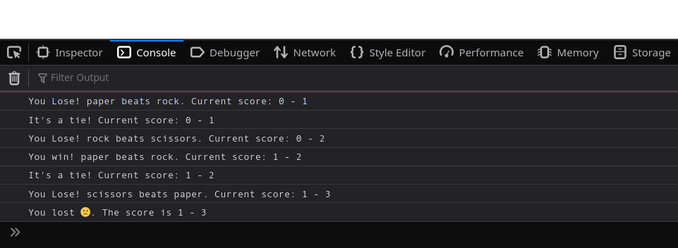

# Rock Paper Scissors 

Project from The Odin Project [Curriculum](https://www.theodinproject.com/paths/foundations/courses/foundations/lessons/rock-paper-scissors)

### **What I learned**:

By doing this project, I learned

- JavaScript fundamentals like conditionals, functions and loops
- using console.log() to output
- using devtools to debug javascript

### **Preview**:

